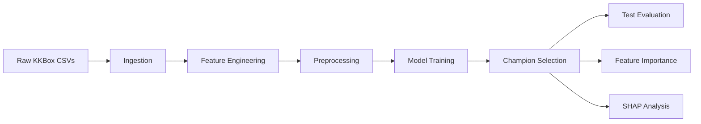

# KKBox Churn Prediction


Leak-safe churn prediction pipeline for the WSDM 2018 KKBox challenge.

This repository is organized like a portfolio-grade machine learning project: raw data ingestion, feature engineering, preprocessing, model training, evaluation, and interpretation are all driven by code and persisted artifacts instead of notebook state.

## Challenge Context

KKBox is a large music streaming platform in Taiwan, and the WSDM 2018 competition asks participants to predict whether a subscriber will churn after membership expiry. The problem is highly imbalanced and leakage-prone, so the project focuses on time-safe feature engineering, ranking metrics, and clean offline evaluation.

## Project Snapshot

| Item | Details |
|---|---|
| Domain | Customer churn prediction |
| Dataset | KKBox WSDM 2018 challenge |
| Champion | `xgboost_optuna_topk` |
| Primary metric | Validation AUC-PR |
| Secondary outputs | Test evaluation, SHAP, feature importances |
| Delivery style | Reproducible ML pipeline with persisted artifacts |

## Key Highlights

- Snapshot-safe modeling frame built from a fixed cutoff date.
- User-level behavioral and demographic feature engineering.
- Baseline and advanced model candidates with champion selection.
- Validation-threshold tuning to improve operational recall.
- Persisted reports for comparison, evaluation, and interpretability.

## Workflow



## Project Overview

The objective is to predict whether a KKBox subscriber will churn after membership expiry using transaction history, listening logs, and member demographics.

The pipeline keeps the full workflow reproducible: snapshot-safe feature engineering, model comparison, champion selection by validation AUC-PR, and offline interpretation outputs.

## Repository Structure

```text
project_churn_prediction/
|-- config/
|   `-- config.yaml
|-- data/
|   |-- raw/
|   |-- interim/
|   `-- processed/
|-- logs/
|-- models/
|-- notebooks/
|   |-- eda.ipynb
|   |-- debug_pipeline.ipynb
|   `-- feature_analysis.ipynb
|-- reports/
|-- src/
|   |-- analysis/
|   |-- data/
|   |-- features/
|   |-- models/
|   `-- utils/
|-- tests/
|-- MODEL_CARD.md
|-- requirements.txt
|-- requirements-dev.txt
`-- README.md
```

## Current Status

- Active champion: `xgboost_optuna_topk`
- Official comparison table: `reports/model_comparison.csv`
- Held-out evaluation: `reports/test_evaluation.csv`
- Interpretation outputs: `reports/feature_importances.csv`, `reports/shap_summary.csv`, `reports/shap_beeswarm.png`, `reports/shap_top20.png`

### Model Comparison

| Model | Val AUC-PR | Val Recall | Val Precision | Decision Threshold |
|---|---:|---:|---:|---:|
| xgboost_optuna_topk | 0.5142 | 0.7072 | 0.3343 | 0.11 |
| xgboost_topk | 0.4999 | 0.7105 | 0.3300 | 0.63 |
| xgboost | 0.4996 | 0.7225 | 0.3190 | 0.59 |
| lightgbm | 0.4963 | 0.7042 | 0.3339 | 0.64 |
| random_forest | 0.4813 | 0.6984 | 0.3256 | 0.50 |
| logistic_regression | 0.3995 | 0.6866 | 0.2750 | 0.08 |

## Installation

### Prerequisites

- Python 3.11
- Git
- Optional: a GPU is not required for this churn pipeline

### Setup Environment

```bash
python -m venv venv
venv\Scripts\activate
pip install -r requirements.txt
```

If you only want the runtime pipeline, `requirements.txt` is enough. Keep `requirements-dev.txt` installed when you need notebooks, tests, or linting.

## Quick Start

### 1. Prepare Data

Place the raw KKBox CSV files in `data/raw/`:

- `train.csv`
- `members_v3.csv`
- `transactions.csv`
- `user_logs.csv`

### 2. Run the End-to-End Pipeline

```bash
python -m src.data.run_ingestion
python -m src.features.run_engineer
python -m src.features.run_preprocessing
python -m src.models.run_train
python -m src.models.evaluate
python -m src.analysis.feature_importances
python -m src.analysis.shap_analysis
```

### 3. Smoke Checks

```bash
python -m src.data.validate_artifacts
python -m pytest -q
```

## What Each Stage Does

- `src.data.run_ingestion`: chunked raw CSV ingestion and user-level aggregation into `data/interim/`.
- `src.features.run_engineer`: leak-safe feature frame and metadata in `data/processed/`.
- `src.features.run_preprocessing`: train/validation/test splits plus fitted preprocessor.
- `src.models.run_train`: train candidates, log to MLflow, save `reports/model_comparison.csv`, persist the champion.
- `src.models.evaluate`: score the held-out test split and write `reports/test_evaluation.csv`.
- `src.analysis.feature_importances` / `src.analysis.shap_analysis`: interpretation reports in `reports/`.

## Notebooks

- `notebooks/eda.ipynb` documents exploratory analysis and data-quality checks.
- `notebooks/feature_analysis.ipynb` reviews feature importance and SHAP outputs.

All notebooks are stored in valid Jupyter format with notebook-level metadata, so they can be opened directly in VS Code or Jupyter.

## Generated Outputs

Key artifacts: `data/interim/` and `data/processed/` for intermediate tables, `models/` for the champion and preprocessors, `reports/` for comparison/evaluation/SHAP outputs, and `logs/` for pipeline traces.

## Modeling Notes

- Logistic Regression uses a separate OneHot + RobustScaler preprocessing path.
- Tree-based models use ordinal-encoded splits.
- XGBoost and LightGBM use early stopping on validation metrics.
- The champion threshold is tuned on validation data and persisted to `models/champion_threshold.txt`.
- MLflow logging is enabled for training runs when configured.

## Troubleshooting

- If a notebook does not open, verify that the file still has valid `.ipynb` JSON structure and notebook metadata.
- If training fails, confirm that the raw CSVs exist in `data/raw/` and that `python -m src.data.run_ingestion` completed successfully.
- If SHAP or Optuna imports fail, confirm that `requirements.txt` and `requirements-dev.txt` are installed in the active environment.
- If VS Code shows a webview or service worker error, reload the window, restart VS Code, and reopen the notebook tab.

